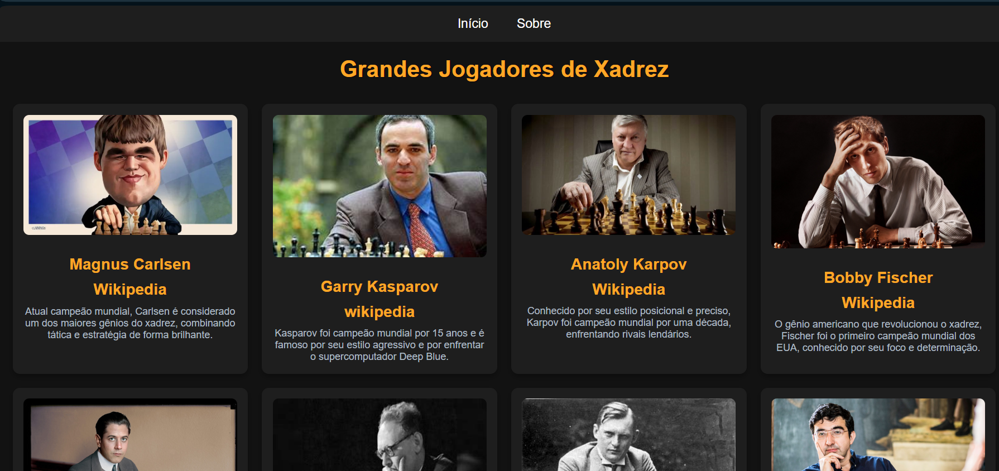

# Blog Grandes Jogadores de Xadrez
<div align="center">  </div>

## Sobre o Projeto
Este projeto foi desenvolvido como uma atividade da disciplina **Laboratório de Produção de Software**. O objetivo foi criar um blog simples que apresenta alguns dos maiores jogadores de xadrez da história, destacando suas conquistas e estilos de jogo.

## Tecnologias Utilizadas
- **HTML5**: Estruturação do site
- **CSS3**: Estilização e layout

## Estrutura do Projeto
O projeto é composto pelos seguintes arquivos:

```
/
├── index.html       # Página principal com os jogadores
├── sobre.html       # Página com informações sobre o blog
├── postagem.html    # Exemplo de página de post sobre um jogador
├── styles.css       # Arquivo de estilos CSS
├── assets/          # Pasta contendo as imagens dos jogadores
└── postagens/       # Pasta contendo páginas individuais dos jogadores
```

## Funcionalidades
- **Página Inicial:** Lista de jogadores com breve descrição e links para mais detalhes.
- **Página Sobre:** Informações sobre o blog e seus criadores.
- **Páginas Individuais:** Detalhes sobre cada jogador com imagem, biografia e curiosidades.
- **Link Wikpédia:** Link que redireciona para acessar mais informações de cada jogador
- **Formulário de Comentários:** Área para os visitantes deixarem feedback sobre os jogadores.
- **Design Responsivo:** Adaptável para diferentes dispositivos.

## Como Executar o Projeto
Para visualizar o projeto em seu navegador:
1. Faça o download ou clone este repositório.
2. Abra o arquivo `index.html` em um navegador web.

## Equipe de Desenvolvimento
- **Thiago Allan** – Desenvolvedor & Data Engineer
- **Ademilson Ribeiro** – Desenvolvedor
- **Felipe Rebelo** – Web Designer

## Licença
Este projeto foi desenvolvido para fins educacionais e pode ser utilizado livremente.

---
Projeto criado para a disciplina **Laboratório de Produção de Software**, 2025.

